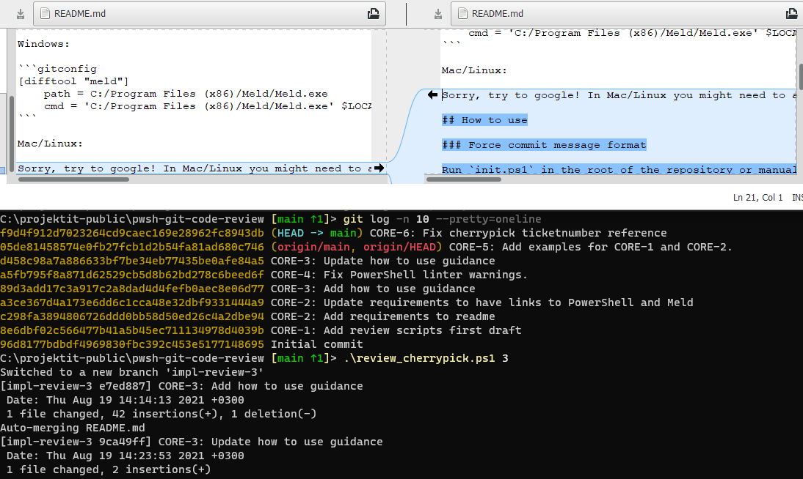

# pwsh-git-code-review

Tool and examples about how to make code reviews with git without pull requests.

## Requirements

Tool was created and tested with **[PowerShell](https://aka.ms/powershell-release?tag=stable)** version 7.1.4 (the one on top of .NET Core / .NET 5).

Tool expects you to have **[Meld](https://meldmerge.org/)** installed as a difftool in your git global config `git config --global -e`. It should look something like below.

Windows:

```gitconfig
[difftool "meld"]
    path = C:/Program Files (x86)/Meld/Meld.exe
    cmd = 'C:/Program Files (x86)/Meld/Meld.exe' $LOCAL $BASE $REMOTE --output=$MERGED
```

Mac/Linux:

Sorry, try to google! In Mac/Linux you might need to also chmod +x the .githooks/commit-msg file and in worst case make dos2unix bit conversion for the `.githooks\commit-msg`file.

## How to use

### Force commit message format

Run `init.ps1` in the root of the repository or manually run `git config core.hooksPath .githooks`. This sets git to uuse `.githooks` folder as a source for **[githooks](https://git-scm.com/docs/githooks)**.

This will eventually run `.githooks/commit-msg` when commiting changes. It checks that each commit is of format `<prefix>-<nnn>: <keyword> something` e.g. `CORE-2: Add requirements to readme`. Ticket prefix can be changed from `data/ticketprefix.txt`.

### Review commits for a ticket

There are two options supported:

1. Linear comparison between the first commit for the ticket and the last commit for the ticket.
2. Cherry pick commits for a ticket and compare them to a commit before first commit for a ticket.

#### Linear comparison

Run `.\review_linear_comparison.ps1 1` where 1 is the ticket number CORE-1.

1. It takes all commits that have been prefixed with `CORE-1:`.
2. It construct comparison from first commit to last (including all other commits).
3. It prints which files were changed in those commits that belonged to this ticket.
4. Finally it runs `git difftool --no-prompt --dir-diff --tool=meld` for the commit-range deduced which eventually opens Meld for diffing.

#### Cherry picking

Run `.\review_cherrypick.ps1 1` where 1 is the ticket number CORE-1.

1. It checks with `git status --porcelain` that there are no changes pending.
2. It takes all commits that have been prefixed with `CORE-1:`.
3. It creates two branches for the commit before the first commit for the ticket.
4. It runs `git cherry-pick` for each commit for this ticket to second branch.
5. It runs `git difftool --no-prompt --dir-diff --tool=meld` between the two branches.
6. Finally the two branches created gets deleted.

#### Only stats for ticket

Run `\review_stats.ps1 1` where 1 is the ticket number CORE-1. This gets called in linear comparison too.

1. It takes all commits that have been prefixed with `CORE-1:`.
2. It collects and sums changes from each commit for the ticket with `git diff --numstat` and `git diff --name-status`.
3. It prints out the results.

#### Print urls for commits in ticket

Run `\review_commit_urls.ps1 1` where 1 is the ticket number CORE-1.

1. It takes all commits that have been prefixed with `CORE-1:`.
2. It prints out urls to GitHub for each commit for this ticket

## Examples

### CORE-1

Reviewing CORE-1 ticket shows the power of dir-diff for the only [one commit](https://github.com/solita/pwsh-git-code-review/commit/8e6dbf02c566477b41a5b45ec711134978d4039b) it has. Here is linear comparison but it looks the same with cherry-picking. 

### CORE-2

CORE-2 has two commits [1](https://github.com/solita/pwsh-git-code-review/commit/c298fa3894806726ddd0bb58d50ed26c4a2dbe94) and [2](https://github.com/solita/pwsh-git-code-review/commit/a3ce367d4a173e6dd6c1cca48e32dbf9331444a9). 

Review tool merges looks the two commits as a whole and prints that only readme had changed. 

### CORE-3

CORE-3 has two commits [1](https://github.com/solita/pwsh-git-code-review/commit/89d3add17c3a917c2a8dad4d4fefb0aec8e06d77) and [2](https://github.com/solita/pwsh-git-code-review/commit/d458c98a7a886633bf7be34eb77435be0afe84a5) but there is also a [CORE-4 commit](https://github.com/solita/pwsh-git-code-review/commit/a5fb795f8a871d62529cb5d8b62bd278c6beed6f) in the middle of them changing same file. Luckily git was able to automerge because no same rows were changed and so our cherry-picking worked.



## This is awesome, I want to use it

MIT license is permissive. Take what you want and use it. By design decision I split all the goodies into their own files. They could be combined into one file easily but I think this way examples are clearer. Most likely you want to make some changes to this if you start using it as review processes tends to change from person to person. It should be relatively easy to glue pieces together and give switches for the "one tool" if you choose that path.
